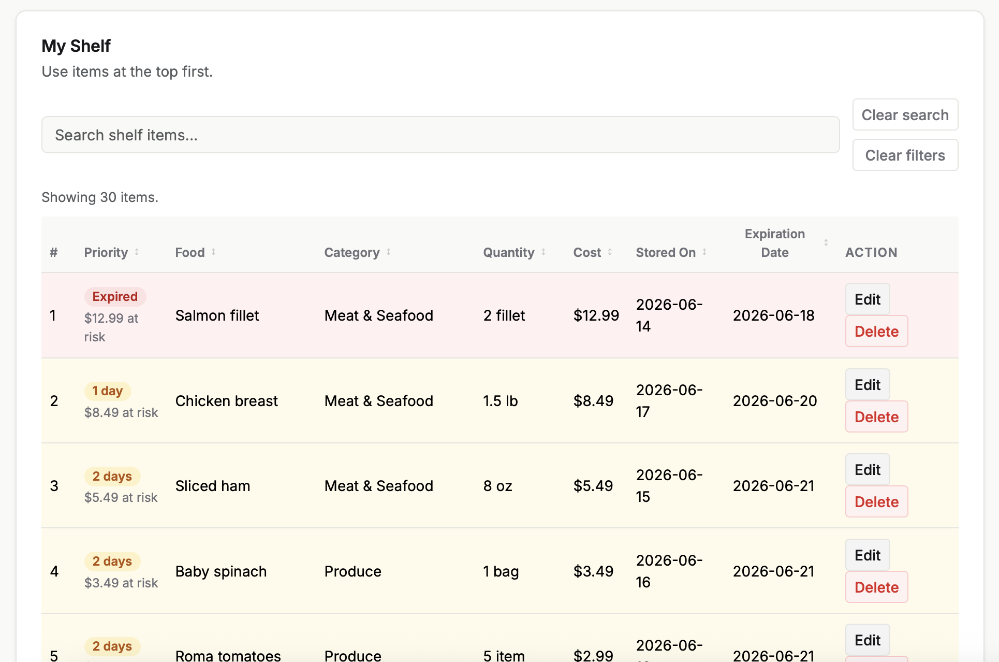
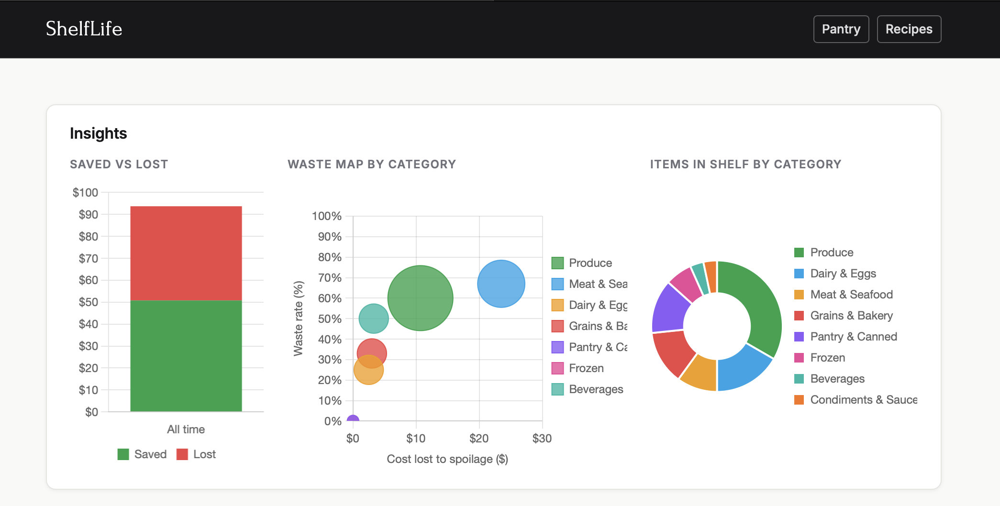
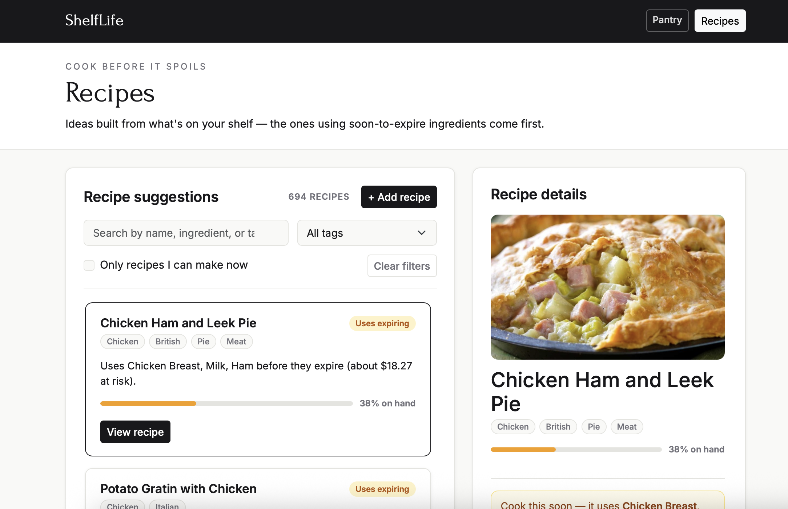
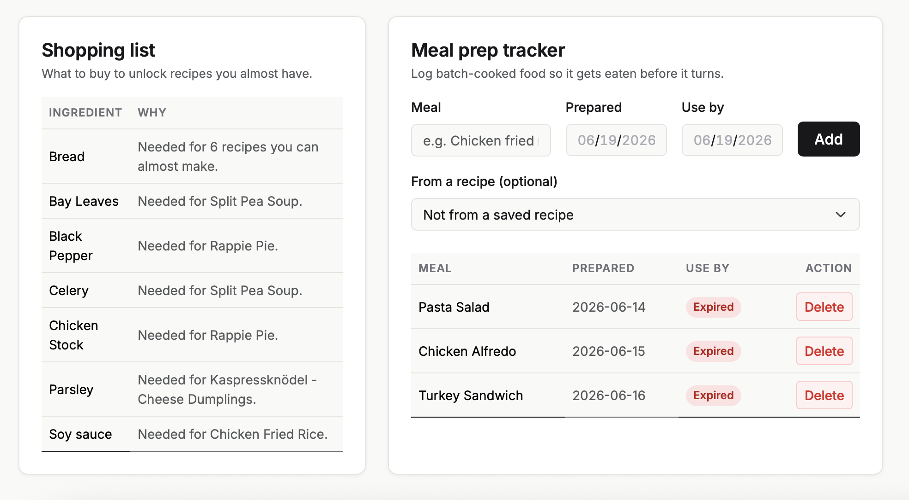

# ShelfLife

ShelfLife is a full-stack web application that helps you reduce food waste by tracking pantry inventory, monitoring expiration dates, surfacing recipe ideas from what you already own, and logging meal-prepped food before it spoils.

## Authors

James Hicks and Alexandra Descoteaux

## Class Link

[Web Development — Online, Summer 2026 (Prof. John Guerra)](https://johnguerra.co/classes/webDevelopment_online_summer_2026/)

## Project Objective

Help users track pantry items, monitor expiration dates, get recipe ideas from ingredients they already own, and keep meal-prepped food organized so less food is wasted.

## Deployment

<https://shelflife-21gd.onrender.com/index.html>

## Screenshots

### Pantry dashboard — inventory



### Pantry dashboard — insights



### Recipes — suggestions and details



### Recipes — shopping list and meal prep



## Getting Started

### Prerequisites

- Node.js 18+
- A running MongoDB instance (local or Atlas)

### Setup

1. Install dependencies:
   ```bash
   npm install
   ```
2. Create a `.env` file in the project root (it is git-ignored). Copy
   `.env.example` and set your MongoDB connection string:

   ```bash
   cp .env.example .env
   ```

   ```bash
   # .env
   MONGODB_URI=mongodb://localhost:27017
   PORT=3000
   ```

   `MONGODB_URI` can point to a local MongoDB instance or an Atlas cluster.
   `PORT` is optional and defaults to `3000`.

3. Seed the database with sample pantry items, recipes, and ingredients:
   ```bash
   npm run seed
   ```
4. Start the server:
   ```bash
   npm start
   ```
5. Open `http://localhost:3000` in your browser.

To run with auto-restart on file changes:

```bash
npm run start:nodemon
```

To refresh the recipe/ingredient dataset from TheMealDB (not required — data is committed):

```bash
npm run fetch:dataset
npm run seed
```

## Usage

### Managing Your Pantry

1. Open the **Pantry** page (`/`).
2. Click **Add Item** to open the slide-out drawer. Fill in the name, category, quantity, unit, cost, stored date, and expiration date, then save.
3. The inventory table sorts items by spoilage priority — the most urgent items appear first.
4. Click any row to edit a field inline. Changes are saved immediately.
5. Click the trash icon on a row to remove an item. The app records whether the item was used in time (saved), used well before expiry (neutral), or expired (wasted) and logs it to the history for insights.

### Browsing Recipes

1. Open the **Recipes** page (`/recipes.html`).
2. Recipe cards are ranked automatically — meals that use ingredients nearing expiration appear first, helping you rescue what would otherwise be wasted.
3. Use the search box to filter by recipe name, ingredient, or tag.
4. Use the tag chips to filter by category (e.g., "Chicken", "Vegetarian").
5. Toggle **Make It Now** to show only recipes you can cook with what you currently have on hand.
6. Click a recipe card to open the detail panel. You will see:
   - Cook and prep time, difficulty, and servings.
   - An ingredient checklist showing which items you have vs. what you still need.
   - Estimated cost to cook, calculated from the quantities and prices in your pantry.
   - Step-by-step instructions.

### Using the Shopping List

The **Smart Shopping List** (bottom-left of the Recipes page) suggests ingredients to buy that would unlock recipes you are close to making. It only surfaces items you are missing from recipes where you already have at least 50% of the ingredients.

### Tracking Meal Prep

1. On the Recipes page, find the **Meal Prep Tracker** panel.
2. Enter the food name, prep date, and use-by date, then click **Log**.
3. The tracker lists all prepped foods sorted by the soonest to expire. A summary panel on the Pantry dashboard shows freshness status at a glance.
4. Remove an item from the tracker once it has been eaten.

### Viewing Waste and Savings Insights

The **Insights** tab on the Pantry page shows charts summarizing your history:

- Total value saved vs. wasted.
- Item counts broken down by outcome.
- Waste rate and value at risk per food category.

These stats update automatically each time you remove an item from the shelf.

## Features

- **Pantry management** — add, edit, and remove items with quantity, cost, and expiration tracking. The table paginates at 25 items and ranks by spoilage urgency.
- **Recipe recommendations** — hundreds of recipes ranked to prioritize ingredients that are close to expiring, weighted by cost.
- **"Make It Now" filter** — instantly shows only recipes you can cook without buying anything.
- **Recipe cost estimation** — each card shows an estimated cook cost derived from the measures in the recipe and the prices you paid for matched shelf items.
- **Add & edit recipes** — create your own recipe through a form, or edit any recipe (name, ingredients with amounts, steps, timing, tags, etc.) from its detail panel.
- **Cook this** — mark a recipe cooked and the matching ingredients are deducted from your pantry by the amount the recipe uses; depleted items are removed and every portion is logged to history so it flows into your savings/waste insights.
- **Smart shopping list** — suggests what to buy to unlock near-ready recipes (skipping pantry staples), and lets you add any suggestion straight to your pantry with one click.
- **Meal-prep tracker** — log batch-cooked food with a quantity (e.g. "4 servings"), edit entries inline, and watch use-by reminders so leftovers get eaten in time.
- **Waste/savings insights** — charts show money saved, money wasted, and per-category breakdowns based on your removal history.

## API Reference

All endpoints are prefixed by their route base.

### Shelf — `/api/shelf`

| Method   | Path             | Description                            |
| -------- | ---------------- | -------------------------------------- |
| `GET`    | `/api/shelf`     | Return all shelf items                 |
| `POST`   | `/api/shelf`     | Add a new shelf item                   |
| `PUT`    | `/api/shelf/:id` | Update a shelf item by MongoDB `_id`   |
| `DELETE` | `/api/shelf/:id` | Remove an item and write it to history |

**Shelf item fields:** `name`, `storedDate`, `expirationDate`, `quantity`, `quantityUnit`, `cost`, `category`

### Recipes — `/api/recipes`

| Method   | Path                                | Description                               |
| -------- | ----------------------------------- | ----------------------------------------- |
| `GET`    | `/api/recipes`                      | Paginated, ranked recipe list             |
| `POST`   | `/api/recipes`                      | Create a custom recipe                    |
| `GET`    | `/api/recipes/names`                | Lightweight id + name list for dropdowns  |
| `GET`    | `/api/recipes/tags`                 | All distinct recipe tags                  |
| `GET`    | `/api/recipes/ingredients`          | Ingredient names for autocomplete         |
| `GET`    | `/api/recipes/shopping-suggestions` | Suggested items to buy                    |
| `GET`    | `/api/recipes/meal-prep`            | All logged meal-prep items                |
| `POST`   | `/api/recipes/meal-prep`            | Log a new meal-prep item (with quantity)  |
| `PUT`    | `/api/recipes/meal-prep/:id`        | Edit a meal-prep item                     |
| `DELETE` | `/api/recipes/meal-prep/:id`        | Remove a meal-prep item                   |
| `GET`    | `/api/recipes/:id`                  | Full recipe detail with pantry match data |
| `PUT`    | `/api/recipes/:id`                  | Edit a recipe by its slug `id`            |
| `POST`   | `/api/recipes/:id/cook`             | Deduct matched ingredients from the shelf |

**Recipe list query params:** `search`, `tag`, `ready` (boolean), `page`, `pageSize` (max 50)

### History — `/api/history`

| Method | Path                       | Description                              |
| ------ | -------------------------- | ---------------------------------------- |
| `GET`  | `/api/history`             | All history records, newest first        |
| `GET`  | `/api/history/stats`       | Aggregate saved/wasted totals and counts |
| `GET`  | `/api/history/by-category` | Per-category waste and savings breakdown |

## Data Collections

The app reads and writes five MongoDB collections (1,000+ seeded records in total):

- `shelf` — current pantry inventory.
- `history` — items removed from the shelf, used for waste/savings insights. Each record has an `outcome` field: `"saved"` (removed within 7 days of expiry), `"wasted"` (removed after expiry), or `"used"` (removed well before expiry).
- `recipes` — a hand-written catalog (`database/recipe-data.js`) plus a large imported set of real recipes; supports create, read, and update from the UI.
- `ingredients` — an ingredient reference list that powers search autocomplete.
- `mealPrep` — tracked meal-prepped foods with quantities; supports create, read, update, and delete.

## Tech Stack

- **Backend:** Node.js, Express 5, MongoDB (ES modules throughout — no CommonJS `require`)
- **Frontend:** Vanilla JavaScript, HTML5, CSS — client-side rendering with `fetch`
- **Data:** Recipe and ingredient data sourced from [TheMealDB](https://www.themealdb.com), fetched once and committed to `database/dataset/` so seeding requires no network access

## Scripts

| Script                  | Description                                      |
| ----------------------- | ------------------------------------------------ |
| `npm start`             | Start the Express server                         |
| `npm run start:nodemon` | Start with auto-restart on changes               |
| `npm run seed`          | Seed all MongoDB collections                     |
| `npm run fetch:dataset` | Refresh `database/dataset/*.json` from TheMealDB |
| `npm run lint`          | Run ESLint                                       |
| `npm run lint:fix`      | Run ESLint with auto-fix                         |
| `npm run format`        | Format all files with Prettier                   |
| `npm run validate`      | Run format check and lint together               |
